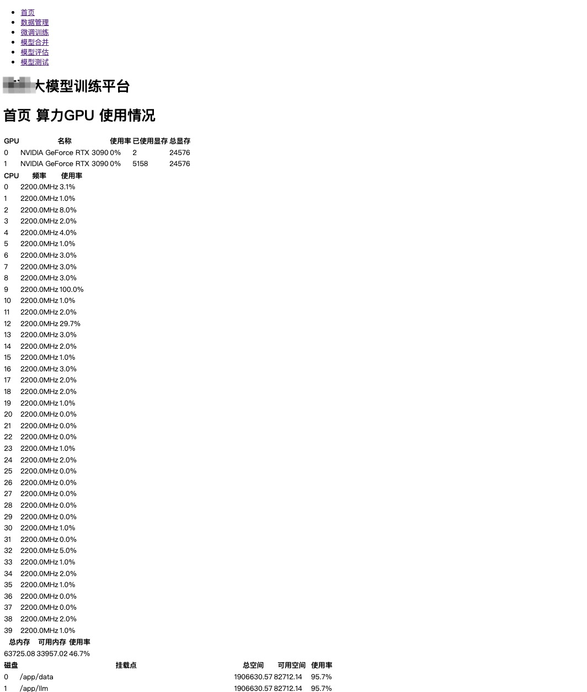
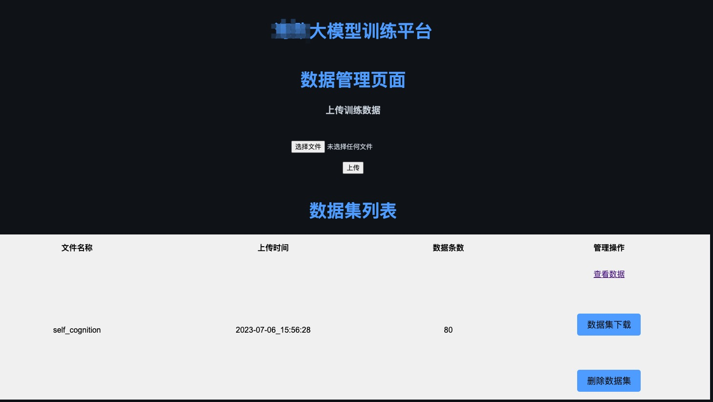
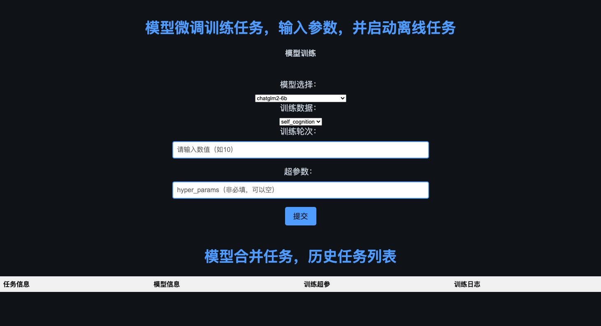
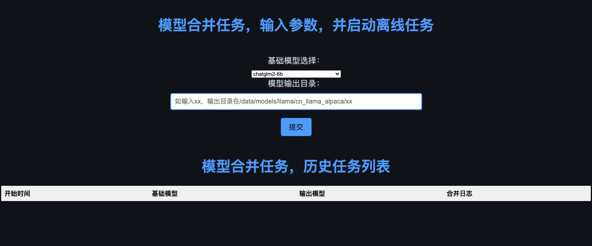
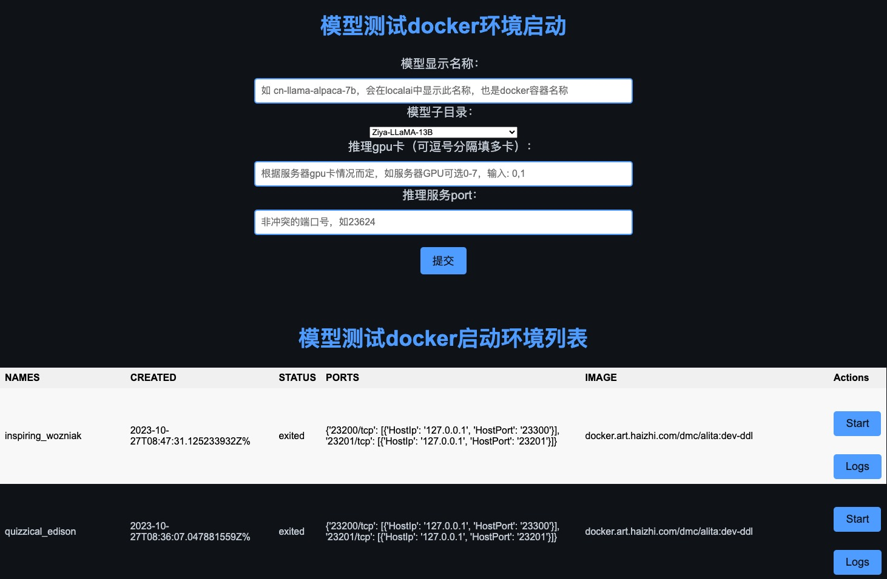
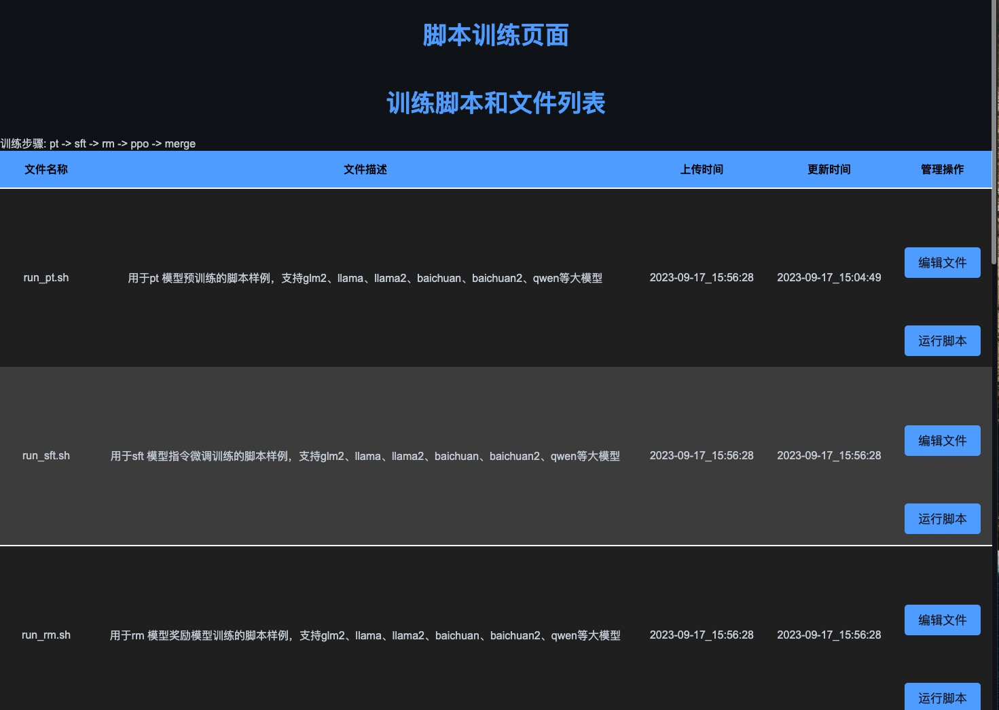

平台用来给不了解研发、算法的人员使用的，所以平台的使用尽量简单，不需要用户了解太多的细节，只需要按照流程操作即可。
用最简的页面，包括首页资源查看、训练数据上传下载、大模型微调训练、大模型权重合并输出、大模型能力评估、大模型部署服务启动等功能。
最后的训练脚本页面，开发人员能够自由修改脚本，提供了更高级的使用方法。

# 首页
- GPU资源查看
- CPU资源使用率
- MEM资源使用率
- DISK资源使用率

# 数据管理
- 支持数据上传、下载、查看、删除
- 支持json、excel格式的sft数据集

# 微调训练
- 极简页面一键训练，支持模型选择、数据选择、训练参数（也可不填用默认值）
- 训练过程中支持查看日志
- 列表展示历史训练记录
  

# 模型合并
- 极简页面一键合并，支持基座模型选择、输出目录指定
- 合并过程中支持查看日志
- 列表展示历史合并记录
  

# 模型评估
- 极简页面一键评估，支持模型选择、数据选择、评估参数（也可不填用默认值）
- 评估过程中支持查看日志
- 列表展示历史评估记录
  

# 模型测试
- 快速部署大模型服务（fastapi+docker），支持模型命名、模型选择、GPU卡、端口指定
- 部署过程中支持查看docker日志
- 列表展示docker部署情况，支持启动停止操作
  

# 训练脚本
- 高级开发用法，支持训练脚本在线编辑、运行
- 支持预训练pt、微调训练sft、奖励模型训练rm、强化学习ppo/dpo、模型合并merge等脚本
 