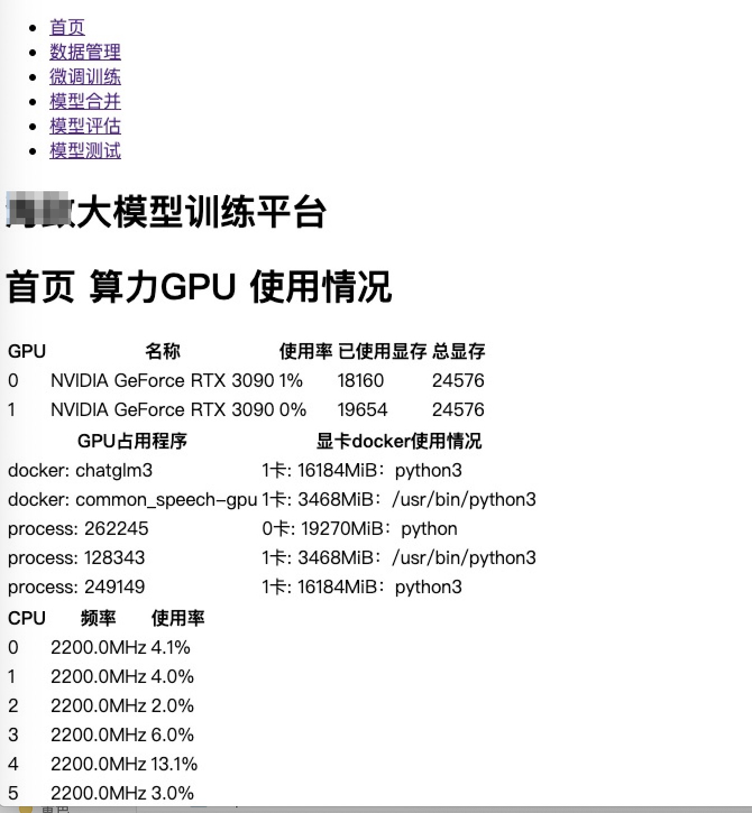

平台用来给不了解研发、算法的人员使用的，所以平台的使用尽量简单，不需要用户了解太多的细节，只需要按照流程操作即可。
用最简的页面，包括首页资源查看、训练数据上传下载、大模型微调训练、大模型权重合并输出、大模型能力评估、大模型部署服务启动等功能。
最后的训练脚本页面，开发人员能够自由修改脚本，提供了更高级的使用方法。

# 首页

# 数据管理

# 微调训练

# 模型合并

# 模型评估

# 模型测试

# 训练脚本